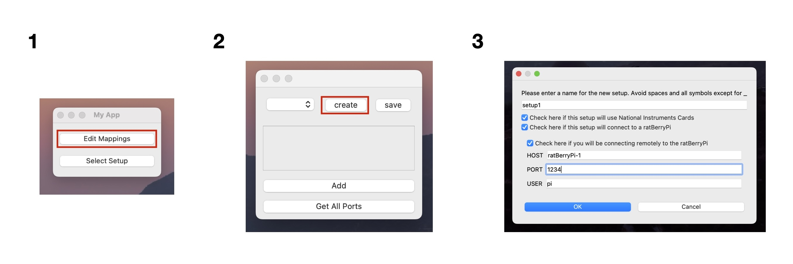

# pyBehavior
pyBehavior is a python-based framework for developing GUIs that interface with an animal behavioral aparatus. This repository contains a set of GUI elements that users are meant to either sub-class and customize, or use out-the-box to build custom GUIs. The framework also provides support for the development of automated, self-documenting behavioral protocols which can be run through the GUIs. Knowledge of PyQt5 is helpful but not strictly necessary for devloping GUIs in this framework. pyBehavior protocols, however, are simply an abstraction of the StateMachine class in the python-statemachine library. As a result, for details about creating a state machine in python we point users to their [documentation](https://python-statemachine.readthedocs.io/en/latest/readme.html). 

## Getting Started
### Installation
Before installing be sure to have the [Anaconda distribution of Python](https://www.anaconda.com/download) installed on your device. Once you've done this, follow the below steps for instalation:

1. Clone this repository
2. Navigate to the cloned repository from a conda-enabled shell and run the following command to create an environment with all dependicies:
```
conda env create -f environment.yml
conda activate pyBehavior
```
Alternatively if you already have a conda environment you would like to install pyBehavior into, simply update your environment with the environment.yml file as follows:
```
conda env update -n <yourEnv> -f environment.yml
```

3. Run the following commands to build and install pyBehavior
```
python -m pip install .
```
If your setup uses national instruments cards, instead run:
```
python -m pip install '.[ni]'
```

### Starting the GUI for the first time
On a new device you will need to start by creating a new root setup directory which will store all GUI code and protocols for any setups you will be interfacing with on this device. This directory should be empty at first as the GUI provides tools that should be used to create new sub-directories for individual setups. To get started with creating such a sub-directory start the GUI as follows after activating the appropriate conda environment:

```
python -m pyBehavior.main --setup_dir /path/to/root/setup/dir
```

 From here select `Edit Mappings` and click the `create` button at the top of the new window. This will open a dialog where you can enter information about the setup.

 

 Once completed, if you are interfacing with national instruments cards you will want to first use the map editor window to assign names to any relevant ports on your national instruments cards, indicate whether or not they should be used as a digital input, and save. At this point you can close all windows to work on developing the setup GUI. Once you've finished developing the setup GUI and any protocols you would like to run on it, you can launch your GUI by running the above command again and instead choosing `Select Setup` to select and open your GUI. At the top of your GUI you'll find a drop down menu where you can select a protocol to run. 

## Creating your first Setup GUI
Here we will describe the process of creating a setup GUI. For an example of a root setup directory with functioning setup GUIs defined inside see the example folder. After using the GUI to create the setup sub-directory you should see that your setup root directory has the following structure:


```
root_dir
└───setup1
    │   gui.py
    │   port_map.csv
    │   rpi_config.yaml
    │
    └───protocols
        │   ...
    
```

where `setup1` is the hypothetical name of the setup you just created. You will only see `port_map.csv` if you are interfacing with a national instruments card. This contains the names you assigned to the ports in the GUI as well as whether or not they should be treated as a digital input. `rpi_config.yaml` will only appear if you are using a [ratBerryPi](https://github.com/Siapas-Laboratory/ratBerryPi) and contains relevant information for interfacing with the pi. The `protocols` sub-directory is empty at first but is where you should put files with code for behavioral protocols you would like to run on the setup (see [Creating a New Protocol](#creating-a-new-protocol)). `gui.py` is where you will build the GUI for the setup. It should have some version of the following starter code already in it:

```
from pyBehavior.gui import *

class setup1(SetupGUI):
    def __init__(self):
        super(setup1, self).__init__(Path(__file__).parent.resolve())

```

This code imports the relevant GUI elements from pyBehavior and defines the GUI main window by sub-classing the SetupGUI class and calling its init method (**NOTE: Do NOT alter the definition of this class. pyBehavior assumes the GUI class has the same name as the setup folder it is in**). See the help documentation for the SetupGUI class for more details on methods available to you through this class. Here we will briefly discuss the essential features needed to build a basic GUI. 

### Adding Reward Widgets
When building the GUI you will need to create instances of appropriate reward widgets to control any reward endpoints in the setup. These widgets are sub-classes of the `RewardWidget` class defined in pyBehavior.gui. Currently we provide 3 types of reward widgets; these include one for the National Instruments controlled reward modules we have in lab, one for a remote controlled ratBerryPi reward module, and another for locally controlled ratBerryPi reward module. These widgets can be imported and instantiated as follows:

* National Instruments: 
```
from pyBehavior.interfaces.ni import NIRewardControl
from pyBehavior.gui import *

class setup1(SetupGUI):
    def __init__(self):
        super(setup1, self).__init__(Path(__file__).parent.resolve())

        port = 'port/address' # address of ni port that controls the main pinch valve for this module
        name = 'port1' # name of the reward port
        parent = self # this should be a reference to the parent setup gui
        purge_port = 'purge/port/address' # address of ni port that controls the purge valve
        flush_port = 'flush/port/address' # address of ni port that controls the flush valve
        bleed_port1 = 'bleed1/port/address' # address of ni port that controls the first bleed valve
        bleed_port2 = 'bleed2/port/address' # address of ni port that controls the second bleed valve

        reward_module = NIRewardControl(port, name, parent, purge_port, flush_port, bleed_port1, bleed_port2)
```
* remote ratBerryPi:
```
from pyBehavior.interfaces.rpi.remote import RPIRewardControl
from pyBehavior.gui import *

class setup1(SetupGUI):
    def __init__(self):
        super(setup1, self).__init__(Path(__file__).parent.resolve())
        client = self.client # a reference to the ratBerryPi client which is accessible at self.client after calling the super-class's init method 
        module = 'module1' # name of the ratBerryPi module this widget will control
        parent = self # this should be a reference to the parent setup gui
        reward_module = RPIRewardControl(client, module, parent)
```

* local ratBerryPi:
```
from pyBehavior.interfaces.rpi.local import RPIRewardControl
from pyBehavior.gui import *

class setup1(SetupGUI):
    def __init__(self):
        super(setup1, self).__init__(Path(__file__).parent.resolve())
        interface = self.interface # a reference to the ratBerryPi reward interface which is accessible at self.interface after calling the super-class's init method 
        module = 'module1' # name of the ratBerryPi module this widget will control
        parent = self # this should be a reference to the parent setup gui
        reward_module = RPIRewardControl(interface, module, parent)
```


After creating a reward widget you need to add it to the layout for it to be accessible. The GUI's layout is accessible at `self.layout` from within the GUI class and is a PyQt Vertical box layout (QVBoxLayout), thus by adding a widget to it, it will be added below the pre-loaded widgets. In the above examples this could be done by adding the following line within the init method after creating the reward_module 

```
self.layout.addWidget(reward_module)
```

You may instead opt to create a separate layout that you add the widget to such that you have more control over its placement with respect to other GUI elements you may add. For example, you may create a QHBoxLayout that you add several `RewardWidget`s to. This will also work as long as you add this layout to `self.layout`. This can be done as follows:

```
from PyQt5.QtWidgets import QHBoxLayout
layout2 = QHBoxLayout() # create a new horizontal layout
layout2.addWidget(reward_module1) # add the first widget to this layout
layout2.addWidget(reward_module2) # add the hypothetical second widget to this layout
self.layout.addLayout(layout2) # add the new layout to the main layout
```

Once the widget is accessible, you will finally want to register it to the GUI so that reward can be directed to it using the trigger_reward method of the GUI class. To do this, we offer the `register_reward_module` method of the SetupGUI class as a convenience function. This method can be called as follows:

```
self.register_reward_module('module1', reward_module)
```

This stores the module in a dictionary located at `self.reward_modules` where the keys are the assigned names of the modules and the values are references to the reward widgets themselves. Once registered, you may trigger a reward on this module from an instance method of this class by calling `self.trigger_reward('module1', amt)` where amt is the reward amount in mL.

### Registering state machine inputs
The process of creating a protocol in pyBehavior involves defining a state machine (see [Creating a New Protocol](#creating-a-new-protocol)). In order to link real world events, such as the rising edge of a GPIO pin on a raspberry pi, to actions which can trigger a transition in the state machine, pyBehavior uses pyqt signals. 

Signals in pyqt are essentially notifications that a pyqt object can be configured to emit whenever something happens. For example, in the case of ratBerryPi reward modules, all lickometers have an attribute lick_notifier which stores a reference to an instance of the LickNotifier class, which defines a custom pyqt object with the associated signal `new_lick`. The lickometer is configured to emit the `new_lick` signal of it's lick_notifier whenever a new lick is detected. 

Signals in pyqt generally become useful when they are connected to a slot, or callback function. In our case, we want to connect signals of interest to callback functions which will trigger the appropriate action on the state machine. This is accomplished in pyBehavior through the `register_state_machine_input` method of the setup GUI class. This method takes a provided pyqt signal and connects it to a callback function that formats the data contained in the signal and passes it on to the `handle_input` method of the Protocol class. As discussed later, handle_input is a common entrypoint for all protocols, which for a specific protocol should define what actions of the state machine should be called depending on the type of input it recieves (see [Creating a New Protocol](#creating-a-new-protocol) for details). The result is that whenever the specified signal is emitted the protocol's `handle_input` method is called and the appropriate action can be taken on the state machine.

In the case of the `new_lick` signal from the lickometers discussed above, for convenience, this signal is already connected to a callback function in the local `RPIRewardControl` class which emits a similar signal called `new_lick`. We can register this signal as an input to the state machine as follows:

```
self.register_state_machine_input(self.reward_modules['module1'].new_lick, 'module1 lick')
```

where the second argument is an identifier for the input to the state machine. In our `handle_input` method of the protocol class we can then identify this input as follows:

```
def handle_input(self, data):
    if data['type']=='module1 lick':
        # do something
```

For completeness, we note that the equivalent signal for the remote ratBerryPi interface can be accessed through the `new_licks` attribute of the reward widget. Thus, if module1 were a remote ratBerryPi reward module, registering `new_licks` would instead look like this:


```
self.register_state_machine_input(self.reward_modules['module1'].new_licks, 'module1 lick')
```

This signal carries with it data indicating the number of new detected licks since the last time the signal was emitted. This data can be accessed in `handle_input` as follows:

```
def handle_input(self, data):
    if data['type']=='module1 lick':
        n_licks = data['data']
        # do something
```

the `register_state_machine_input` method also allows users to specify metadata to pass on to `handle_input` and a function to call on the signal data before running `handle_input`. Metadata can be accessed from `handle_input` at the `'metadata'` field of the input data. For more details, we point interested users to the docstrings of `register_state_machine_input`.

### Considerations for National Instruments Digital Inputs
If any ports on a national instruments card have been specified as digital inputs, the setup GUI will automatically start a daemon that polls these ports at a 1kHz sampling rate in the background. The daemon holds reference to a set of signals that are emitted on the rising or falling edge of a digital input. These signals can be accessed through the `ni_di` property of the setup GUI class which will return a dataframe with indices corresponding to user specified port names and columns `rising_edge` and `falling_edge`. As implied, `rising_edge` stores the signals emitted on the rising edge of the associate digital input and `falling_edge` the signals for the falling edge. As such, both the rising and falling edge of all digital lines can be registered as state machine inputs or connected to arbitrary callback functions as needed using the `ni_di` property. For example, the rising edge of a digital input called 'lick' can be registered as follows:

```
self.register_state_machine_input(self.ni_di.loc['lick'].rising_edge, 'lick')
```

### Eventstring Handlers
Often times it may be useful to have a mechanism of timestamping events that are logged through pyBehavior with a common clock. In order to do this, pyBehavior provides support for sending events that it logs as "event strings" to a timestamping unit while simultaneously sending a TTL pulse. For this to be a useful feature, you would need to have a separate program running that is set up to timestamp digital inputs while receiving messages over a TCP/IP port and logging them. This feature is currently only supported for setups with access to national instruments digital i/o ports. In order to make use of the feature you need to use the `add_eventstring_handler` method to create an EventstringSender object which will handle sending the event strings. When calling this method you will need to specify a name for the handler, what digital i/o port you want to write the ttl pulses to and the port you will be sending the messages to. The `add_eventstring_handler` method also returns reference to a widget that can be added to the GUI for users to specify the destination of eventstrings. Once configured, whenever you call the log method of the gui you may optionally specify the name of this handler with the event_line key word argument. By specifiying this argument whenever you log a message it will be sent over TCP/IP to the specified port while a TTL pulse is sent. See below for an example:
```
ev_logger = self.add_eventstring_handler('event0', 'Dev3/port0/line0')
self.layout.addWidget(ev_logger)
self.log('started eventstring handler', event_line='event0')
```
Note if any eventstring handler is configured, the GUI will use it by default whenever it logs anything. To disable this behavior set the `raise_event_line` keyword argument to False when calling self.log.

## Creating a New Protocol
Like many other behavioral control frameworks, pyBehavior operates on the formalization of behavioral protocols as [fine state machines](https://en.wikipedia.org/wiki/Finite-state_machine). As a result when developing a protocol you will first need to think about how to cast your task as a finite state machine. When casting your task as a state machine, it's important to keep in mind that actions will generally only be called when a registered input to the state machine is triggered. The only action you may configure that can be triggered independently of a registered input is a timeout, which we will discuss later. All other action should be thought of as extensions of registered inputs. 

Each protocol should be defined in it's own python file in the protocols sub-directory of the associated setup. These files should contain within them the definition of a class with the same name as the file. This class must be a sub-class of the Protocol class defined in pyBehavior.protocols. The Protocol class, importantly,is simply an abstract version of the StateMachine class from python-statemachine library (for details see the [python-statemachine documentation](https://python-statemachine.readthedocs.io/en/latest/readme.html)). The main difference between the StateMachine class and Protocol is that subclasses of Protocol must define a handle_input method. This is critical because handle_input functions as a common method to all Protocols that the setup GUI expects and calls in order to perform actions through the state machine whenever inputs are received. As such, handle_input must define the logic of what actions should be called depending on the provided input (see [Registering State Machine Inputs](#registering-state-machine-inputs)). handle_input should take as input one argument which will be a dictionary with the fields 'type', 'metadata', and 'data'. As described above, inputs can be identified by the 'type' field. As a result, your handle_inputs method will generally have the following structure:

```
def handle_inputs(self, data):
    if data['type'] == 'a':
        action_a()
    elif data['type'] == 'b':
        action_b()
```

where action_a and action_b are actions defined for the state machine. 

Because your protocols will be sub-classes of the Protocol class, it is essential that you call the init method of the super class if you need to define an init method for your protocol. You can do this as follows:

```
from pyBehavior.protocols import Protocol

class example(Protocol):
    def __init__(self, parent):
        super(example, self).__init__(parent)

```

parent here is an argument that the Protocol init method expects and that is passed by the setup GUI when instantiating the protocol. In practice it is a reference to the parent setup GUI that is running while this protocol is running. The reference is stored at self.parent. As such, users may call methods defined through the setup GUI from the protocol as needed through self.parent. For example we may trigger a reward by calline `self.parent.trigger_reward(...)`

One additional feature provided by the Protocol class is a mechanism for implementing timeouts as actions in your state machine. Timeouts are a common feature in many tasks where you would like a specified amount of time to pass before transitioning to the next stage of the task. This feature is provided through the start_countdown method of the protocol class. In order to implement the timeout action you must define an action named `timeout` in your protocol with associated state transitions. You may then call the `start_countdown` method of the protocol class whenever you would like to initiate the countdown to the calling of the timeout action. This function takes as input the time in seconds to coundown for. There is also a `stop_countdown` method which can be called to stop the countdown before it calls the timeout action. This method is called within start_countdown before starting the countdown.

An example where this can be useful is a simple protocol where the animal is tasked with initiating reward delivery by licking. We may not necessarily want every lick to trigger reward delivery. Instead it would be favorable for a single lick to trigger reward after a long enough period of no licking. We can implement this by defining a state machine with 2 states, licking and not_licking, and 2 actions, lick and timeout. When the animal licks while in the licking state the state machine stays in this state. If it licks while in not_licking it will initiate a reward before transitioning to licking. We can enter the not_licking state by a timeout action which is triggered after a countdown that is reset everytime we enter the licking state. The code for this is as follows:


```
from pyBehavior.protocols import Protocol
from statemachine import State

REWARD_AMOUNT = 0.5
TIMEOUT_PERIOD = 5

class lick_for_reward(Protocol):
    
    not_licking = State(initial=True)
    licking = State(enter='start_nolick_countdown')

    lick = (licking.to.itself() |
            not_licking.to(licking, before='reward'))
    timeout = licking.to(not_licking)

    def reward(self):
        self.parent.trigger_reward('module1', REWARD_AMOUNT, force = False, enqueue = True)

    def start_nolick_countdown(self):
        self.start_countdown(TIMEOUT_PERIOD)

```

